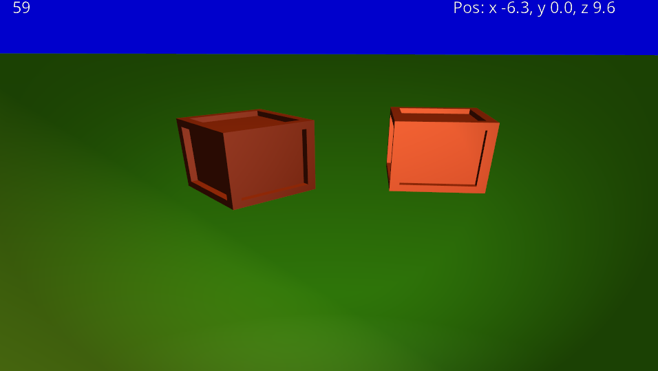

# OpenGL_Game
a simple game in 3D programmed directly with OpenGL

Models can be created with Blender and then exported as OBJ format for example.
The ModelConverter Tool import the Vertices, Indices and the Material from the file(s)(in case of OBJ an extra MTL file will be created and needed
using the Open-Asset-Importer-Library. The tool then exports the data into a custom BMF file. where the data can be loaded by the game really fast.

The Game itself use the libary SDL to create a window and OpenGL-context. Also the libary GLEW is used to get the current OpenGL functions.
For the mathematics (Matrices and Vectors) the libary OpenGL Mathematics is used.

On the Graphiccard side i use the shader programming language GLSL
https://www.khronos.org/opengl/wiki/Core_Language_(GLSL)

For importing Textures and Fonts i use the STB Libary.

As Mapfiles i use the XML format. To parse them i use the tinyxml2 Library.

The idea and the knowlegde for this project did i get from this german youtube OpenGL tutorial playlist:
https://www.youtube.com/playlist?list=PLStQc0GqppuWBDuNWnkQ8rzmyx35AINyt
https://github.com/Pilzschaf/OpenGLTutorial

used Libaries:

https://www.assimp.org/
https://github.com/assimp/assimp

https://www.libsdl.org/

https://www.opengl.org/
https://github.com/topics/opengl

http://glew.sourceforge.net/
https://github.com/nigels-com/glew

https://glm.g-truc.net/0.9.9/index.html
https://github.com/g-truc/glm

https://github.com/nothings/stb
https://github.com/nothings/stb/blob/master/stb_image.h
https://github.com/nothings/stb/blob/master/stb_truetype.h

https://github.com/leethomason/tinyxml2

used Textures from:
https://opengameart.org/
https://3dtextures.me
http://www.texturise.club

