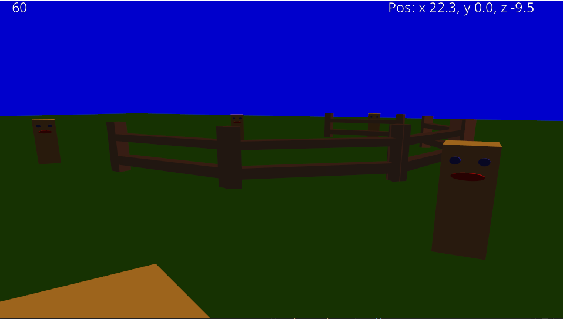
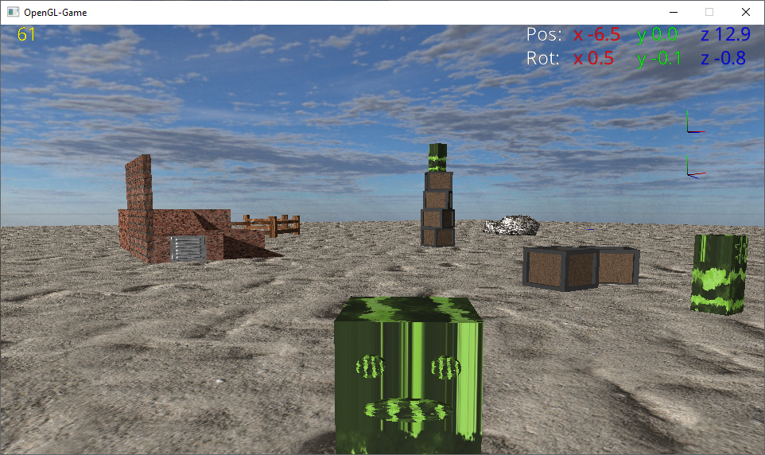
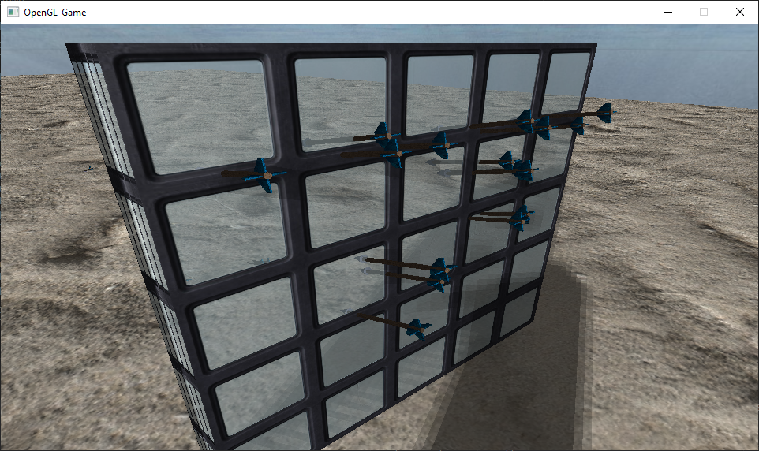
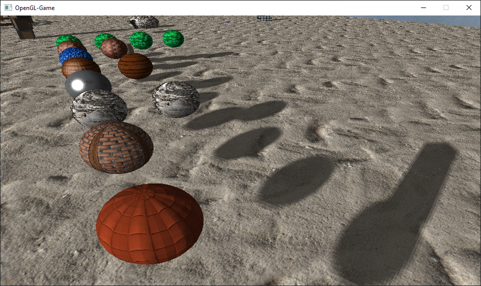

# OpenGL_Game
a simple game in 3D programmed directly with OpenGL

Models can be created with Blender and then exported as OBJ format for example. Also FBX format works great for me.
The ModelConverter Tool import the Vertices, Indices and the Material from the file(s)(in case of OBJ an extra MTL file will be created and needed
using the Open-Asset-Importer-Library. The tool then exports the data into a custom BMF file. where the data can be loaded by the game faster.

The Game itself use the Library SDL to create a window and OpenGL-context. Also the Library GLEW is used to get the current OpenGL functions.
For the mathematics (Matrices and Vectors) the Library OpenGL Mathematics is used.

On the Graphics Card side i use the shader programming language GLSL
https://www.khronos.org/opengl/wiki/Core_Language_(GLSL)

For importing Textures and Fonts i use the STB Library.

As Mapfiles i use the XML format. To parse them i use the tinyxml2 Library.

for playing audio the irrKlang-Library is used.

The idea and the knowlegde for this project did i get from this german youtube OpenGL tutorial playlist:
https://www.youtube.com/playlist?list=PLStQc0GqppuWBDuNWnkQ8rzmyx35AINyt
https://github.com/Pilzschaf/OpenGLTutorial

On of the first versions that had just material properties and no textures

Implementation of textures, skybox, colored hud elements.
That version had also already simple physic, the boxes in the middle are standing on top of each other

Transparent textures with alpha blending and arrows that have collision with the object and get stuck in it

A couple of testballs to test different textures and material properties. Metal (left in the middle) doesnt look well with the phong shading model.
It is missing reflections of the world. Also the game renders shadows with the shadow mapping technique

used Libaries:

Assimp for model loading and converting
https://www.assimp.org/
https://github.com/assimp/assimp

SDL for creating a window and the OpenGL-Context
https://www.libsdl.org/

OpenGL for rendering 3D objects
https://www.opengl.org/
https://github.com/topics/opengl

GLEW for easier handling of new OpenGL functions
http://glew.sourceforge.net/
https://github.com/nigels-com/glew

GLM for the matrices/vector calculations
https://glm.g-truc.net/0.9.9/index.html
https://github.com/g-truc/glm

stb for loading fonts and textures/images
https://github.com/nothings/stb
https://github.com/nothings/stb/blob/master/stb_image.h
https://github.com/nothings/stb/blob/master/stb_truetype.h

TinyXML2 for parsing the level-file
https://github.com/leethomason/tinyxml2

irrKlang for 2D and 3D audio
https://www.ambiera.com/irrklang

used Textures from:
https://3dtextures.me